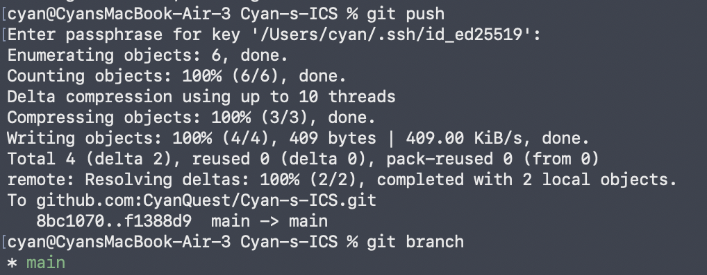
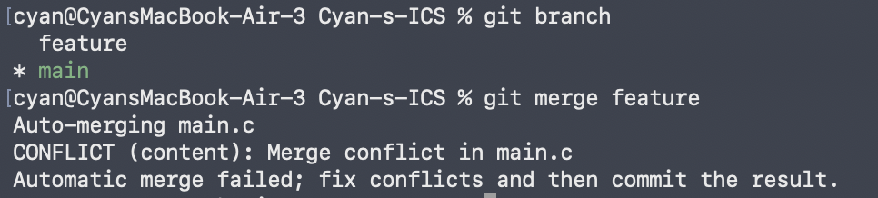
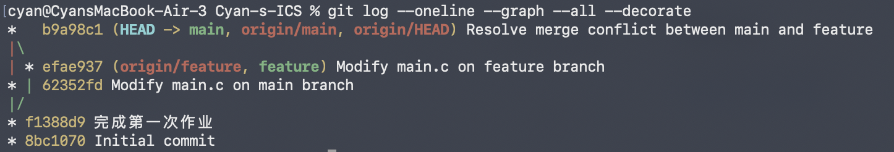

# Git 基础与分支管理实验报告

**姓名：** 陈钰泉  
**学号：** 24307090037  
**个人仓库：** [CyanQuest/Cyan-s-ICS](https://github.com/CyanQuest/Cyan-s-ICS/tree/main)  
**完成日期：** 2026 年 9 月 15 日

## 一、实验目的

1. 掌握 Git 仓库克隆、修改、暂存、提交和推送的基本流程。
2. 理解 Git 工作区、暂存区和本地仓库之间的关系。
3. 掌握分支的创建、切换与查看方法，理解本地分支和远程跟踪分支的区别。
4. 通过在两个分支中修改同一处代码，观察合并冲突并完成手动解决。
5. 了解规范的 Commit Message 和 Git Flow 分支管理方法，认识 Git 在多人协作中的作用。

## 二、文档问题回答

### 2.1 多人协同开发经历

我曾在《人工智能导论》课程项目中参加过多人协同开发。当时四名同学组成一组，共同完成一个字符级 Transformer。我们使用 GitHub 进行版本管理：`main` 分支保留老师提供的基础代码，四名同学分别在各自的本地环境中完善代码，并把结果推送到各自的分支。之后，小组对各分支的实验结果进行比较，最终将 loss 最低的同学的代码合并到 `main` 分支。

这段经历使我认识到，分支可以隔离不同成员的修改，避免大家直接改动同一份主线代码；提交历史则能够记录每次修改的来源和目的。不过，回顾这一协作方式，仅以“loss 最低”决定最终合并仍较为简单。更规范的项目还应结合代码审查、可复现性、测试结果和可维护性，再决定哪些修改进入主分支。

### 2.2 Git 为什么设计“暂存—提交”两个步骤

Git 没有把“修改文件”和“生成版本”合并成一步，而是在工作区与本地仓库之间设置暂存区（index/staging area）。执行 `git add` 时，选中的文件内容或部分改动进入暂存区；执行 `git commit` 时，Git 将暂存区中的内容保存为一次提交快照，而不是直接提交工作区中的全部修改。

这样的设计主要有以下意义：

1. **可以选择提交范围。** 工作区可能同时包含多个任务的改动，暂存区允许只选取与当前任务有关的文件或代码片段，使一次提交保持单一、清晰。
2. **提供提交前的检查机会。** 可以使用 `git status` 和 `git diff --staged` 检查即将提交的内容，减少误提交调试代码、临时文件或无关改动的风险。
3. **便于组织提交历史。** 同一批工作区改动可以被拆分为多个有明确含义的提交，便于代码审查、回退和定位问题。
4. **支持冲突处理。** 合并发生冲突时，解决后的文件需要重新 `git add`。这一步既更新暂存区，也明确告诉 Git 该冲突已经处理完毕。

因此，暂存区是“编辑中的内容”和“准备记录的版本”之间的一道可控边界。

### 2.3 `git branch` 与 `git branch -a` 的区别

- 不带其他参数的 `git branch` 列出本地分支，当前分支前会显示 `*`。
- `git branch -a` 中的 `-a` 是 `--all` 的缩写，会同时列出本地分支和远程跟踪分支；远程跟踪分支通常显示为 `remotes/origin/main`、`remotes/origin/feature` 等。

需要注意，远程跟踪分支是本地 Git 对远程仓库状态的记录，并不是直接“登录远程服务器后看到的分支”。通常要先执行 `git fetch` 更新这些引用，`git branch -a` 显示的远程状态才是最新的。若只查看远程跟踪分支，可使用 `git branch -r`。

## 三、实验环境与仓库

- 操作系统：macOS
- 终端：zsh
- 版本管理工具：Git
- 远程托管平台：GitHub
- 模板仓库：[ICS-26Fall-FDU/GitLab](https://github.com/ICS-26Fall-FDU/GitLab)
- 个人仓库：[CyanQuest/Cyan-s-ICS](https://github.com/CyanQuest/Cyan-s-ICS/tree/main)


## 四、实验过程


### 4.1 建立个人仓库并完成首次提交

我基于课程模板建立个人仓库，将仓库克隆到本地后进入项目目录。随后编辑 `main.c`，完成其中的 `TODO`。本次填写的内容为：

```c
printf("I want to learn ICS well\n");
```

完成修改后，先查看状态，再将修改加入暂存区并提交：

```bash
git status
git add main.c
git commit -m "完成第一次作业"
git push
```

首次作业对应的提交为 `f1388d9`，提交信息为“完成第一次作业”。下图显示该提交已通过 SSH 成功推送到远程仓库的 `main` 分支。



*图 1：首次提交成功推送到 GitHub，远程* `main` *从* `8bc1070` *更新至* `f1388d9`*。*

### 4.2 创建并修改 `feature` 分支

在首次作业提交的基础上创建并切换到 `feature` 分支：

```bash
git switch -c feature
```

为了主动制造合并冲突，我在 `feature` 分支将同一条输出语句修改为：

```c
printf("I want to learn ICS very well\n");
```

然后提交该修改：

```bash
git add main.c
git commit -m "Modify main.c on feature branch"
```

该提交的短哈希为 `efae937`。

### 4.3 在 `main` 分支修改同一处代码

切换回 `main` 分支：

```bash
git switch main
```

在 `main` 分支中，我对 `main.c` 的同一行作了另一种修改：

```c
printf("I want to learn ICS very very well\n");
```

然后完成提交：

```bash
git add main.c
git commit -m "Modify main.c on main branch"
```

该提交的短哈希为 `62352fd`。至此，`main` 和 `feature` 从共同祖先提交 `f1388d9` 分叉，并且分别对同一行作了不同修改。

### 4.4 合并分支并处理冲突

确认当前位于 `main` 分支后，执行：

```bash
git branch
git merge feature
```

Git 输出 `CONFLICT (content): Merge conflict in main.c`，并提示自动合并失败：



*图 2：在* `main` *分支合并* `feature` *时，*`main.c` *出现内容冲突。*

冲突产生的原因是：两个分支拥有共同的祖先版本，但都修改了 `printf` 所在的同一行，且修改结果不同。Git 可以判断两边都发生了修改，却无法替开发者决定应保留 `very well` 还是 `very very well`，因此停止自动合并并要求人工处理。由此也可以看出，仅仅修改同一个文件不一定产生冲突；通常只有两个分支修改了相同或重叠的代码区域，且 Git 无法自动协调时，才会产生内容冲突。

我打开 `main.c`，检查冲突标记所包围的两个版本，确定最终内容，删除 `<<<<<<<`、`=======`、`>>>>>>>` 等冲突标记，并保留：

```c
printf("I want to learn ICS very very well\n");
```

之后将解决结果重新加入暂存区并提交：

```bash
git add main.c
git commit -m "Resolve merge conflict between main and feature"
```

最后将 `main` 和 `feature` 分支推送到远程仓库，并查看完整提交图：

```bash
git push origin main
git push origin feature
git log --oneline --graph --all --decorate
```



*图 3：冲突解决后的提交图。*`b9a98c1` *同时连接* `main` *与* `feature` *两条历史，是包含两个父提交的 merge commit；远程分支也已同步。*

最终提交关系如下：

```text
*   b9a98c1 (HEAD -> main, origin/main, origin/HEAD) Resolve merge conflict between main and feature
|\
| * efae937 (origin/feature, feature) Modify main.c on feature branch
* | 62352fd Modify main.c on main branch
|/
* f1388d9 完成第一次作业
* 8bc1070 Initial commit
```

其中，`efae937` 和 `62352fd` 表明两个分支从同一提交独立演进；`b9a98c1` 有两个父提交，说明此次操作不是简单的快进合并，而是完成冲突解决后生成的合并提交。

## 五、阅读材料总结


### 5.1 Commit Message 规范

阅读材料：[《Commit message 和 Change log 编写指南》](https://www.ruanyifeng.com/blog/2016/01/commit_message_change_log.html)

文章说明了规范化提交信息的价值：清晰的 Commit Message 能让开发者快速浏览历史、按提交类型筛选记录，并为自动生成 Change Log 提供结构化数据。文章介绍的格式由 Header、Body 和 Footer 组成，其中 Header 是必需部分，常见形式为：

```text
<type>(<scope>): <subject>
```

`type` 用于说明提交类别，如 `feat`、`fix`、`docs`、`style`、`refactor`、`test` 和 `chore`；`scope` 表示影响范围；`subject` 简要描述修改目的。Body 可补充修改动机以及修改前后的差异，Footer 可说明不兼容变更或关联并关闭 Issue。文章还介绍了 Commitizen、提交信息校验工具及根据规范提交自动生成 Change Log 的方法。

结合本次实验，我体会到提交信息不应只写“改了一下”之类模糊内容。例如，`Modify main.c on feature branch` 能指出修改对象和所在分支，`Resolve merge conflict between main and feature` 则说明该提交承担了冲突解决的职责。若进一步采用统一规范，还可以写成 `feat(main): update output message` 等形式，使历史更易于检索和维护。

### 5.2 Git Flow 分支控制

阅读材料：[《Gitflow 使用规范》](https://www.dafaycoding.com/article/git-gif-flow)

文章介绍了 Git Flow 中不同分支的职责与流转方式。`master`（不少项目现称 `main`）保存稳定、可发布的版本；`develop` 作为日常集成分支；`feature` 从 `develop` 创建，用于隔离单项功能开发，完成后合并回 `develop`；`release` 用于发布前测试、修复和版本准备；`hotfix` 则从稳定主线创建，用于紧急修复线上问题，并在完成后合并回相关长期分支。

Git Flow 的核心不是机械增加分支数量，而是让不同性质的工作各自进入职责明确的分支，并规定它们从哪里创建、最终合并到哪里。这样既能保护稳定主线，也能降低多人同时开发时的相互干扰。本次实验虽然只有 `main` 和 `feature` 两个分支，但已经体现了这一思想：新修改先在独立分支发生，再经过检查和合并进入主线。对于规模较小或持续部署频繁的项目，可以简化 Git Flow；无论采用何种模型，分支规则都应服务于团队实际需求。

## 六、为什么要学习 Git

Git 首先解决的是“代码如何可靠地演进”。每次提交都是可追踪的项目快照，使开发者能够比较修改、定位引入问题的提交，并在需要时恢复到先前状态。相比反复复制“最终版”“最终版2”文件夹，Git 的历史更结构化，也更节省空间。

其次，Git 是多人协作的基础设施。分支让不同成员可以并行工作，合并把各自成果重新汇总；即使出现冲突，Git 也会明确标出无法自动判断的位置，由开发者结合需求作出决定。我在字符级 Transformer 课程项目中的协作经历和本次冲突实验都说明，Git 不只是代码备份工具，它还记录了“谁在什么基础上做了什么修改”，从而让协作过程可以审查和追溯。

最后，Git 还能连接代码托管、Pull Request、自动测试、持续集成与发布流程。规范的提交信息和分支策略，能够把个人的修改组织成团队可理解、可验证、可交付的成果。因此，学习 Git 的目标不仅是记住命令，更是建立小步提交、清晰说明、隔离开发、审查后合并的工程习惯。

## 七、实验总结与建议

本次实验完成了从模板仓库建立个人仓库、修改 `main.c`、暂存与提交、推送远程仓库，到创建分支、制造冲突、解决冲突和查看提交图的完整流程。通过实际操作，我对 Git 的理解从单线的“保存代码”扩展到了基于提交图的版本管理：分支本质上指向不同的提交历史，合并则是在这些历史之间建立联系。

实验中最关键的现象是合并冲突。它并不意味着 Git 出错，而是 Git 在无法安全替开发者作决定时采取的保护机制。正确流程是阅读双方修改、确定最终内容、删除冲突标记、重新暂存并提交。今后的协作中，我会在修改前同步最新代码，保持提交内容集中且说明清晰，并通过功能分支和代码审查降低冲突成本。

建议实验文档补充一张“工作区—暂存区—本地仓库—远程仓库”的流程图，并给出一次完整的冲突标记示例。这样初学者能更直观地理解 `git add`、`git commit`、`git push` 之间的区别，以及冲突产生和解决的具体位置。

